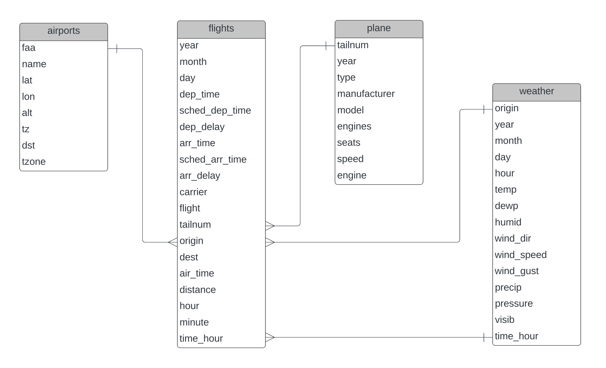

```{r setup, echo=FALSE}
knitr::opts_chunk$set(echo = FALSE)
```

```{r, include=FALSE}
library(tidyverse)
library(lubridate)
library(modelr)
library(janitor)
library(car)
library(ROSE)
```

```{r, include=FALSE}
flights_data <- read_csv("data/flights.csv") %>% 
  janitor::clean_names()
airports_data <- read_csv("data/airports.csv") %>% 
  janitor::clean_names()
weather_data <- read_csv("data/weather.csv") %>% 
  janitor::clean_names()
plane_data <- read_csv("data/planes.csv") %>% 
  janitor::clean_names()
```

## Context

<br>

#### BI and data-driven decision making

<br>

NEED TO POPULATE THIS
!!!!!!!!!!!!!!!!!!!!!!!!!!!!!!!!!!!!!!!!!!!!!!!!!!!!!!!!!!!!!!!

<br>

#### Domain knowledge and the business context

<br>

I received a data set from Newark Liberty International Airport (airport
code "EWR") which contains departing flights from EWR in the year 2017.

The airport is located 10 miles south-west of New York City (NYC) and is
one of three international airports serving NYC, along with La Guardia
and JFK airports. Of the three, EWR is the second busiest. In 2017 over
43 million passengers traveled through the airport compared to 55
million at JFK and 30 million at La Guardia.

In addition to 2017 flight departures, datasets relating to airports,
airlines, planes and weather records for all three NYC airports were
provided to me.

Newark Airport believe poor weather conditions are causing too many
delays to departing flights. They wish to ascertain if this assumption
is correct and if it is, they would look to improve facilities at the
airport to lessen the impact of weather related delays if possible.

Delays to the departure times of airlines operating out of Newark
Airport clearly have business implications for the airport. If delays
persist or become endemic, passengers will choose to fly from
alternative airports. So too with cargo planes. Persistent delays may
see more business shift to La Guardia, JFK or to other airports on the
eastern seaboard of the US.

Airport management are clearly concerned about departure delays and the
causes of delay. The economic consequences of delay are significant as
is reputational damage to the airport if it becomes associated with
delayed flights. Social media now allows each passengers to broadcast
their grievances to the world without filter. Reacting to passenger
grievances after the event may be too late. It's best to manage points
of conflict and inefficiency before a crises erupts. Newark airport
management can be seen to be proactive in their attempts to understand
the source of delays and so work to eliminate or reduce those delays
where possible.

As such I have been asked by Newark Airport to use the data provided to
answer the following business questions:

-   what effect does the weather have on flight departure delays?
-   how serious are weather related delays?
-   what types of weather impacts delays the most?
-   what other factors impact delays?
-   how important are weather factors in comparison to these other factors?
-   compare delays at Newark Airport to the other NYC airports. 
<br> <br>

## Data

<br>

#### Internal and external data sources

<br>

**Internal data** <br> Five data sets were provided to me by Newark
Airport:

*flights* - contained various data points all relating to flights
departing the three NYC international airports during 2017. Examples of
data points include departure date, departure time, departure delay,
arrival time, flight number, distance between origin and destination
airports.

*airports* - details of over 1,300 airports in the USA including their
Federal Aviation Authority (FAA) airport code, latitude and longitude.

*airlines* - the carrier name and code of 12 airlines

*planes* - details of over 3,500 aeroplanes listing amongst other things
their tail number (unique identifier), year of manufacture and seat
numbers (capacity)

*weather* - weather data for all three NYC international airports in
2017.

**External data** <br> Despite an extensive internet search I could not
find free access to hourly weather data for Newark Airport and so was
unable to supplement the data set provided to me.

#### Types of data

The datasets provided contain date-time, numerical and character data
types.

The date-time data type `<dttm>` contains a date plus a time. These are
used for the `time_hour` variables in the data set which records the
date and hour of flight departures and weather recordings.

All of the numeric variables are of type double (or `<dbl>`) which is
the default treatment for numbers and is able to store numbers as
decimals. This is appropriate for the longitude, latitude and wind speed
variables which are continuous in nature but isn't really required for
any of the other numerical variables (e.g. the year a plane was
manufactured or how many engines it has) which could have been classed
as `integer`.

Character variables `<chr>` capture letters, words and can even contain
whole sentences. As an example, they were used in this dataset to
capture, amongst other things, the airline name (`airline`) and tail
number (`tailnum`) of the departing plane.

Logical variables (`<lgl>`) are a categorical variable used to represent
boolean values in R. They can only take the value of 'TRUE' or 'FALSE'.

Factor variables (`<fct>`) are also a form of categorical variable. They
can capture data which cannot be ranked such as gender (male or female).
They can also be used to capture values which have a natural order to
them such as 'clothing size' (S, M, L, XL) or 'film rating' (1 to 5
stars).

I used both logical and factor data types in my analysis to capture
boolean values of 'TRUE' and 'FALSE'.

#### Data formats

All the data sets used in this analysis were provided by Newark Airport.
Each file was in a `.csv` format.

#### Data quality and bias

**Bias** <br>
The data provided is not a complete set of data to describe all
flights departing Newark Airport in 2017. Whilst it is difficult to find
an alternative source for EWR departures statistics it is clear that the
departures listed in the `flights.csv` file are on domestic routes
within the USA in addition to a small number of flights to Puerto Rico.
All of the airlines in the data set are US based and the majority of
these are "low-cost" airlines focused on the domestic US market.

Whilst the `flights` data contains a large set of observations (115,968
departures from EWR), not including international flights distorts the
level of airport activity captured by the data. The degree of airport
"busy-ness" is not properly reflected in the data provided. Similarly,
not including data for arrivals at Newark Airport also distorts the view
of activity at the airport.

Simplifying the data sets provided to me in this way is a clear source
of selection bias which will likely result in the sample of data not
being representative of the wider population of Newark Airport data. If
the true nature of airport activity is not properly reflected in the
data provided then it follows that the relevance of the conclusions
drawn from any analysis conducted on that data are diminished or could
be called in to question.

**Quality** <br>
Looking at each of the data sets in turn, the `flights` data
contained 115,968 records of departing flights from Newark Airport with
19 variables. From this dataset there were three notable variables with
missing values.

-   The amount of time the flight spends in the air (`air_time`) had
    3,266 missing values. Initally I considered these to be erroneous
    values but I came to realise that the more likely explanation was
    that they indicate the corresponding flight had in fact been
    cancelled. As the main focus of my analysis was on departure delays
    rather than cancellations, I opted to remove these records.

-   Departure delays (`dep_delays`), the main focus for the analysis
    requested by Newark Airport, had 2,903 missing values. At less than
    3% of the total sample size, the missing values were not material in
    nature and could either be reconstituted from other variables or
    imputed.

-   Records for the tail number (`tailnum`) of each departing aeroplane,
    the unique identifier for the aircraft, had a similar number of
    missing values. This variable allows the `flights` data to be linked
    to the `planes` dataset. The missing values could not be derived
    from other variables and would mean many observations being dropped
    if the two sets of data were combined. Given that the initial focus
    for my analysis concerned the impact of weather on departure delays,
    it was a surprise to find the `weather` data provided by Newark
    Airport had so many missing values. Of the 9 weather variables
    provided, 5 of them had over 90% missing values. These variables had
    to be removed leaving only 4 weather variables for my analysis.

The `planes` data has 3,521 observations and 9 variables. The variables
`year` and `seats` have a small number of missing values whereas the
`speed` variable has almost 99% missing values.

There were no missing values within the `airlines` data set.

## Ethics

#### Ethical issues in data sourcing and extraction

The data provided is 'open source', meaning that it is openly accessible
to all and shared by Newark Airport to everyone and anyone. There is no
private personal information relating to any individuals contained in
any of the data sets. Airlines companies are listed in the data sets and
departure delay data can be linked to flights they operate. However this
data is already in the public domain so there can be no ethical concerns
in relation to this.

#### Ethical implications of business requirements

The stated aim of this analysis is to allow the management of Newark
Airport to better understand the factors that have an adverse impact on
flight departure times at their airport. No one wants a delay to their
flight; the airline, passengers, customers of freight departures, the
departure airport or the destination airport. As such their can be no
ethical considerations concerning the business requirements.

## Analysis

#### Stages in the data analysis process

I began my analysis by investigating the five data sets that had been
provided to me to familiarise myself with their contents. The `flights`
data had over 303,000 observations with almost 116,000 of these relating
to Newark Airport alone. `flights` contained a great deal of information
relating to the departure time and arrival time of each flight, much of
it repeated information but in a different format or state.

Working through each of the data sets in turn and reviewing these in
relation to each other I was able to understand the landscape of the
data. I also noted how each of the data sets could be linked, allowing
information to be enriched by another data set. The linkages between the
data sets are as follows:



Once I was reasonably comfortable with the data and what it represented,
I began to review the questions Newark Airport had included in their
briefing to me relating to delays and the weather:

-   what effect does the weather have on flight departure delays?
-   how serious are weather related delays?
-   what types of weather impacts delays the most?

Stepping back from the detail of the questions posed by Newark Airport,
the question in my head became:

"What's the best mechanism to link the data provided to departure
delays?"

The question was one of cause and effect. Can we use the weather data to
predict delays in departure times?

**Linear regression** <br> My first thought was to approach this problem
using a linear regression model. Linear regression seeks to predict a
numeric response (in this case it would be delay time) by quantifying
the size and strength of the relationship between numerical values
(delay time and weather metric values).

My attempt to define a linear regression model for delays and weather
data proved inconclusive. On reflection I realised that whilst linear
regression is suited to predicting the value of a numeric variable based
on its relationship to one or more independent variables, the delay
associated with a plane departing an airport cannot possibly have a
linear relationship to a series of independent variables. Their impact
on delay is changeable and dependent on a myriad of combinations of
these variables. A straight line can't be fitted to such data so trying
to predict a value for delay with a linear regression model is not
appropriate.

I realised that in these circumstances it would be better to categorise
the outcome of the analysis (the dependent variable) as having only two
values: `delay` or `no-delay`. Such an approach is perfectly suited to
**logistic regression**. I detail my approach to logistic regression and
findings of my analysis in the **Predictive Analysis** section below.

**Cleaning** <br> Prior to starting my analysis I reviewed the data sets
I would be using and sought to clean the data where possible, isolating
data that related to Newark Airport, removing variables that were not
needed and reviewing the nature of missing values.

Missing values can either be removed or imputed. My approach is to keep
as many observations as possible so deletion is always a last resort.

**Data enrichment** <br> Once the data has been cleaned, the question
becomes "can I enrich the data?", either from another source or by
calculating variables derived from the existing data. As noted earlier
my attempts to find additonal weather data proved fruitless. However, I
was able to enrich the `flights` data by calculating two measures of
"busy-ness" from the existing variables. These additions to the data set
were used in a later analysis, detailed below.

Once data enrichment and cleaning had been completed, I began to build
my models.

**Iteration** <br> Note that the above data analysis process whilst
presented in a linear fashion it is invariably not linear in practice.
It tends to be iterative, as you work with the data and learn more about
it, you can return to earlier stages in your analysis and update these
to reflect your improved understanding of the data and the questions
being asked.
<br>
<br>

#### Tools for data analysis

I outlined my initial thoughts on paper and once I had refined these
sufficiently began to work in `RStudio`. I also made use of the Lucid
website (`https://lucid.app`) to draw relationships between the datasets
and the `ggplot` package in `RStudio` to generate visualisations. These
were the only tools I used during my work on the Newark Airport
assignment.\
<br> <br>

#### Predictive Analysis

<br>

Whilst linear regression seeks to predict a numeric response, logistic
regression seeks to predict the probability of a particular outcome.
Instead of trying to predict the *value* of delay time, a logistic
regression model would seek to predict the *probability* that a flight
would be delayed. That is, given a set of weather events at a particular
time, what is the probability that a flight departing at that same time,
will be delayed?

**Logistic regression** is a classification modelling technique. Whilst
the output of linear regression is a predicted value, the output of
logistic regression is a categorical response. In this instance, `DELAY`
or `NO DELAY`. Logistic regression uses a nonlinear function to model
the relationship between the independent variables and the categorical
response (predicted variable). This ensures that the output is always
between 0 and 1 for all possible combination of input values. <br> <br>

##### (1) Weather related delays

<br>

Turning to the first set of questions from Newark Airport concerning
departure delays and the impact of weather on these.

-   what effect does the weather have on flight departure delays?
-   how serious are weather related delays?
-   what types of weather impacts delays the most?

To begin to answer these questions, data relating to Newark Airport had
to be selected from each of the available data sets, where appropriate.

**Flight data** <br> Flights leaving Newark Airport can be extracted
from the main flights dataset (`flights_data`) after joining with
`airports_data` and filtering on Newark Airport's full name, "Newark
Liberty International Airport".

```{r, include=FALSE}
# capture only newark airport flights
newark_flights <- inner_join(flights_data, airports_data, by = c("origin" = "faa")) %>% 
  filter(name == "Newark Liberty International Airport") 
```

The `newark_flights` data contains 26 variables with 115,968
observations.

```{r}
glimpse(newark_flights)
```

Some of the data is superfluous and is repeated for each entry so we can
remove details of Newark Airport such as the `name` and `latitude` and
`longitude` and altitude, time zone, daylight saving and departing
airport (`alt`, `tz`, `dst`, `tzone`, `origin`).

Instead of the day number represented by `day`, it might be beneficial
to include a variable for the the day name to capture the days of the
week. This can be extracted from `time_hour`. As such the current `day`
variable should be removed as should `year` as each observation is for
the same year.

The `hour` and `time_hour` variable captures sufficient information
about the scheduled departure time so `dep_time` can be removed as can
`sched_dep_time`. The `minute` variable is also superfluous.

The arrival times, both scheduled and actual, and arrival delay are not
predictor variables as they are a consequence of any delay on departure
so can be removed.

The flight number (`flight`) also does not have a predictive quality. It
doesn't describe the departure or the circumstances at the time of
departure, so should be removed.

```{r}
newark_flights <- newark_flights %>% 
  select(-c(name, lat, lon, alt, tz, dst, tzone, origin)) %>% 
  select(-c(year, day, minute)) %>% 
  select(-c(dep_time, sched_dep_time, arr_time, sched_arr_time, arr_delay)) %>% 
  select(-flight) %>% 
  mutate(day = wday(time_hour, label = TRUE)) # new day name variable
```

From this, we reduce the number of variables from 26 to 10.

```{r}
glimpse(newark_flights)
```

There are a number of missing values across the dataset. Logistic
regression is intolerant of missing values. It can't model the size and
strength of a relationship with missing values.

```{r}
colSums(is.na(newark_flights))
```

Before acting on these, we start by looking at the statistical
distribution (summary statistics) of the values for each of the three
variables.

```{r}
newark_flights %>% 
  select(dep_delay, tailnum, air_time) %>% 
  summary()
```

The amount of time the flight spends in the air (`air_time`) has a
considerable number of missing values. These could be considered
erroneous but more likely they indicate that the flight has been
cancelled. A new variable (`cancelled`) with values `TRUE` and `FALSE`
could be added to capture this information allowing the `NA` (missing)
values within `air_time` to be converted to a zero value. This would
allow another regression model to be constructed to predict
cancellations. For the moment, we will remove the `NA` values within
`air_time` but make a mental note for future reference.

```{r, include=FALSE}
# remove NAs from air_time
newark_flights_clean <- newark_flights %>% 
  drop_na(air_time)
```

For `dep_delay` we can use mean imputation to resolve the missing
values.

```{r}
newark_flights_clean <- newark_flights_clean %>% 
  mutate(dep_delay = coalesce(dep_delay, mean(dep_delay, na.rm = TRUE)))
```

The summary statistics are relatively unchanged for `dep_delay`

```{r}
newark_flights_clean %>% 
  select(dep_delay) %>% 
  summary()
```

For the remaining `tailnum` variable, I'll replace missing values with
"ABCXYZ".

```{r}
newark_flights_clean <- newark_flights_clean %>% 
  mutate(tailnum = ifelse(is.na(tailnum), "ABCXYZ", tailnum))
```

The result of all this cleaning is a new dataset,
`newark_flights_clean`, which contains no missing values.

```{r}
colSums(is.na(newark_flights_clean))
```

The number of observations has reduced by the number of `NAs` or
cancelled flights (3,266) captured within `air_time`. We now have
112,702 observations.

```{r}
dim(newark_flights_clean)
```
<br>

*Outliers* <br> Logistic regression models are sensitive to outliers
within the dataset.

Let's deal first with the `newark_flights_clean` data.

```{r, message=FALSE}
newark_flights_clean %>% 
  select(air_time, distance) %>% 
  gather() %>% 
  ggplot() +
  geom_histogram(mapping = aes(x = value, fill = key), colour = "black") +
  facet_wrap(~ key, scales = "free") + 
  theme_minimal()
```

<br> There is a skew in both the `air_time` and `distance` data within
the flights dataset. This is due to departing flights to Honolulu in
Hawaii.

As a rule-of-thumb, the skew may be resolved by removing any value that
is larger (right skew) or less than (left skew) 1.5 times the
interquartile range (IQR). Quartiles divide an ordered set of values in
to four equal parts. The IQR of a set of values is the difference
between the values for the first quartile (Q1) and the third quartile
(Q3). The value for Q1 is the middle number between the smallest number
and the median whilst the Q3 value is the middle number between the
median and the highest number.

```{r}
# remove outliers from flights data
newark_flights_clean <- newark_flights_clean %>% 
  mutate(max_air_time = quantile(air_time, 0.75) + (1.5 * IQR(air_time))) %>% 
  mutate(max_distance = quantile(distance, 0.75) + (1.5 * IQR(distance))) %>% 
  filter(air_time <= max_air_time) %>% 
  filter(distance <= max_distance) %>% 
  select(-c(max_air_time, max_distance))
```

Applying this rule-of-thumb to the `newark_flights_clean` data we only
lose 716 observations and the range of values for each of these
variables is much reduced.

```{r, message=FALSE}
newark_flights_clean %>% 
  select(air_time, distance) %>% 
  gather() %>% 
  ggplot() +
  geom_histogram(mapping = aes(x = value, fill = key), colour = "black") +
  facet_wrap(~ key, scales = "free") + 
  theme_minimal()
```

*Dependent variable* <br> There is currently no dependent variable
(class) in the `newark_flights_clean` dataset so we should add one.
Logistic regression requires this. Newark Airport are interested in
departure delays. Although the US aviation authority (The FAA) state
that flights departing with less than a 15 minute delay are deemed to be
'on time', we will classify all flights with a departure delay of
greater than 0 as being delayed. The new column will be called `delayed`
and have the value of `TRUE` or `FALSE`. Once added we can remove the
`dep_delay` variable.

```{r}
# add dependent variable
newark_flights_clean <- newark_flights_clean %>% 
  mutate(delayed = ifelse(dep_delay > 0, TRUE, FALSE), .after = dep_delay) %>% 
  select(-dep_delay)
```

**Weather data** <br> Weather observations relating to Newark Airport
can be extracted from the larger `weather_data` sample by filtering on
"EWR", the FAA code for Newark Airport.

```{r}
# capture only newark weather
newark_weather <- weather_data %>% 
  filter(origin == "EWR")
```

The newark weather data contains 15 variables with 8,735 observations.

```{r}
glimpse(newark_weather)
```

Despite an extensive internet search I could not find free access to
hourly weather data for Newark Airport to supplement the provided data
set.

There are a number of missing values across the weather dataset.

```{r}
colSums(is.na(newark_weather))
```

All of these variables are numeric.

Before cleaning, we start by looking at the summary statistics.

```{r}
newark_weather %>% 
  keep(is.numeric) %>% 
  summary()
```

The following variables have so many missing entries (recorded as `NAs`)
that it makes no sense to impute values for them and they should just be
removed from the dataset: `temp`, `dewp`, `humid`, `precip` and
`pressure`.

In addition, `origin` should also be removed as the value for all
observations is "EWR", the FAA airport code for Newark Airport.

Variables `year`, `month`, `day` and `hour` are already included within
`time_hour` so can be safely removed.

```{r}
newark_weather_clean <- newark_weather %>% 
  select(-c(temp, dewp, humid, precip, pressure)) %>% 
  select(-c(origin, year, month, day, hour))
```

The missing values for `wind_dir`, `wind_speed`, `wind_gust` and `visib`
should be imputed with mean values.

```{r}
newark_weather_clean <- newark_weather_clean %>% 
  mutate(wind_dir = coalesce(wind_dir, mean(wind_dir, na.rm = TRUE)), 
         wind_speed = coalesce(wind_speed, mean(wind_speed, na.rm = TRUE)),
         wind_gust = coalesce(wind_gust, mean(wind_gust, na.rm = TRUE)),
         visib = coalesce(visib, mean(visib, na.rm = TRUE)))
```

The summary statistics should remain relatively unchanged for these
variables, which they do.

```{r}
newark_weather_clean %>% 
  select(wind_dir, wind_speed, wind_gust, visib) %>% 
  summary()
```

There are now no missing values within the `newark_weather_clean`
dataset.

```{r}
colSums(is.na(newark_weather_clean))
```

For the retained variables there has been no loss of data - there are
still 8,735 observations.

```{r}
dim(newark_weather_clean)
```
<br>

*Outliers* <br>

Outliers in the newark weather dataset.

```{r, message=FALSE}
newark_weather_clean %>% 
  keep(is.numeric) %>% 
  gather() %>% 
  ggplot() +
  geom_histogram(mapping = aes(x = value, fill = key), colour = "black") +
  facet_wrap(~ key, scales = "free") + 
  theme_minimal()
```

Wind direction (`wind_dir`) is not skewed so we will retain all of those
observations. Visibility (`visib`) has a limited range of values and so
will be excluded from quantile reduction. For the `wind_speed` and
`wind_gust` we will remove those values more than 1.5 times the IQR (or
less than in the case of visibility).

```{r}
# remove outliers from the weather data
newark_weather_clean <- newark_weather_clean %>% 
  mutate(max_wind_gust = quantile(wind_gust, 0.75) + (1.5 * IQR(wind_gust))) %>% 
  mutate(max_wind_speed = quantile(wind_speed, 0.75) + (1.5 * IQR(wind_speed))) %>% 
  filter(wind_gust <= max_wind_gust) %>% 
  filter(wind_speed <= max_wind_speed) %>% 
  select(-c(max_wind_gust, max_wind_speed))
```

We lose 120 observations and the range of values for both of the wind
variables is much reduced.

```{r, message=FALSE}
newark_weather_clean %>% 
  keep(is.numeric) %>% 
  gather() %>% 
  ggplot() +
  geom_histogram(mapping = aes(x = value, fill = key), colour = "black") +
  facet_wrap(~ key, scales = "free") + 
  theme_minimal()
```

<br> <br>

**Flight delays and Weather** <br> We want to examine the impact of
weather on delays at Newark Airport, so we should join the cleaned
weather data to the cleaned flights data set using the `time-hour` 
variable which is common in both sets of data.

```{r}
newark_weather_delays <- 
  inner_join(newark_flights_clean, newark_weather_clean, by = "time_hour") %>% 
  select(delayed, wind_dir, wind_speed, wind_gust, visib)
```

The (inner) join results in a loss of 1,204 observations from the
`newark_flights_clean` dataset of 111,986 or a 1% loss in data. The
losses occur where there is no weather data for the `time_hour`
specified in the flights data. <br>

*Splitting the dataset* <br> We now want to create a training set of
data for our model. Once we have trained the model to recognise (we
hope) when weather causes a flight delay, we can then test the efficacy
of the model on the remaining data, the test set.

```{r}
# number of rows of data in newark_delays dataset
rows = nrow(newark_weather_delays)

# create a training set
sample_set <- sample(rows, rows * 0.75, replace = FALSE)
weather_delays_train <- newark_weather_delays[sample_set,]

# create a test set
weather_delays_test <- newark_weather_delays[-sample_set,]
```

We want to make sure that the class distribution of the data in the
samples mimics that of the original data set. By class distribution, we
refer to the value of the dependent variable (`delayed`) be it `TRUE` or
`FALSE` and the number of each in the set of data.

```{r, echo=TRUE}
# class distribution in original dataset
round(prop.table(table(select(newark_weather_delays, delayed), exclude = NULL)), 3) * 100 
```

```{r, echo=TRUE}
# class distribution in training set
round(prop.table(table(select(weather_delays_train, delayed), exclude = NULL)), 3) * 100 
```

```{r, echo=TRUE}
# class distribution in test set
round(prop.table(table(select(weather_delays_test, delayed), exclude = NULL)), 3) * 100 
```

There is a slight class imbalance in the training data set. Ideally we
would like to have a balanced data set for the model to learn from
otherwise it will be skewed towards the dominant class in the data,
which in our example is a FALSE (or negative) result for `delayed`. The
imbalance is not massively significant so we will continue but make a
note for further model development in the future. <br>

*Training the model* <br> Let's build the model using the training set
of data and call the model `weather_delays_mod1`.

```{r, echo=TRUE}
weather_delays_mod1 <- glm(formula = delayed ~ ., data = weather_delays_train, family = binomial(link = "logit"))
```

<br>

*Evaluating the model* <br> We get a detailed description of the model
using the `summary()` function.

```{r}
summary(weather_delays_mod1)
```

<br>

The coefficients error regarding singularities is most likely due to
multicollinearity, or a perfect linear relationship existing between two
of the variables.

We can produce a correlation matrix to see this.

```{r}
cor(weather_delays_train[, c("wind_dir", "wind_speed", "wind_gust", "visib")])
```

<br>

We can see that `wind_speed` and `wind_gust` are perfectly correlated
(value = 1.0). Let's drop `wind_speed` from the model and re-run it.

```{r, echo=TRUE}
weather_delays_mod2 <- glm(formula = delayed ~ wind_dir + wind_gust + visib,
                           family = binomial(link = "logit"),
                           data = weather_delays_train)
```

<br>

```{r}
summary(weather_delays_mod2)
```

<br>

Of the weather variables, visibility (`visib`) has a very small
`p-value` denoted by Pr(\>\|z\|) and is the only statistically significant weather 
variable (indicated by the 3-stars) as a predictor of flight delays.

The coefficient of each variable is quoted in log-odds. For every unit
increase in the value of `visib`, the log-odds of `delayed` being `TRUE`
changes by approximately -0.08. In terms of odds, we have to exponeniate the
coefficient as follows:

```{r}
exp(coef(weather_delays_mod2)["visib"])
```

Assuming all other factors are held constant, this value is interpreted
as the odds of a flight being delayed decrease by approximately 0.91 for each
additional mile of visibility gained. <br>

*Predictive accuracy* <br> We need to assess the preformance of our
model (which is based on training data) in predicting the dependent or
response variable for observations in the test data set. This is data
the model has not seen so acts as a proxy for the model's general
applicability against unseen data.

To assess model performance, we create a 'confusion matrix' which shows
the interaction between the predicted and actual values. We assume a
probability threshold of 0.5 for `TRUE`.

```{r}
# add predictions to test data set
weather_delays_test_and_pred <- weather_delays_test %>% 
  add_predictions(weather_delays_mod2, type = "response")

# convert predictions to TRUE/FALSE assuming a threshold of 0.5
threshold <- 0.5
weather_delays_test_and_pred <- weather_delays_test_and_pred %>% 
  mutate(pred_thresh_0.5 = pred >= threshold)
```

```{r}
conf_table_weather_delays <- weather_delays_test_and_pred %>% 
  tabyl(delayed, pred_thresh_0.5)

conf_table_weather_delays
```

The correct predictions of the model are top left (True Negatives) and 
bottom right (True Positives) of the table.

The accuracy of the `weather_delays` model = (TP + TN) / Total Observations = 62%.

Given that only one weather variable is statistically significant, this
result is surprisingly good. <br>

*Other diagnostics* <br> The predictive accuracy of the model must be
seen in light of other diagnostic variables captured by the `summary()`
function above.

-   the difference between the null and residual deviance values
    indicates how much the model's performance was enhanced by the
    inclusion of the weather predictor variables such as `visib`. The
    larger the difference, the better. The difference between the two
    values in the `weather_delays_mod2` model is very small indicating
    that the weather variables added little predictive value.

-   the AIC value (Akaike Information Criterion) is a quantification of
    how well the model explains variablility in the data. A lower number
    is better. We should compare the AIC value (110297) of the
    `weather_delays_mod2` with subsequent logistic regression models to
    better understand this model's performance.
    

Lastly, the receiver operating characteristic (ROC) curve is a single graphical 
representation of the effectiveness of a logistic regression model. 

A model with no predictive value would be represented by a line at 45 degrees. 

```{r, message=FALSE, echo=FALSE}
library(pROC)

weather_model_roc <- weather_delays_test_and_pred %>% 
  roc(response = delayed, predictor = pred)

weather_roc_curve <- ggroc(data = weather_model_roc, legacy.axes = TRUE) +
  coord_fixed() + 
  ylab("True positive rate") + 
  xlab("False positive rate") +
  geom_line(data = data.frame(x = c(-Inf, Inf), y = c(-Inf, Inf)), aes(x, y), linetype = "dashed")

weather_roc_curve
```
<br>
The weather model produces a predictive curve that is very close to 45 degrees. 

The area under the curve (AUC) can be measured as 54%:

```{r}
auc(weather_model_roc)
```


*Conclusions* <br>
Whilst the predictive accuracy of the model is reasonably high, most flights are not
delayed so the accuracy is bouyed by defaulting to the common outcome. 

The model is weak as indicated by the null and residual deviance scores having 
little divergence. They also appear to be high in value. 

The AIC value also appears to be high especially when compared to models 
detailed later in this paper. 

In terms of weather, the most impactful variable is visibility. It is the only statistically 
significant predictor variable in the model. This makes perfect sense. We know from our 
own anecdotal experience, poor visibility often plays a factor in plane crashes 
reported in the media. The pilot is human and still relies on his own eyesight as 
much as the instruments on the dashboard in front of him.   

Lastly, the AUC score for the model is barely above that of a 45 degree line, 
indicating poor predictive capability. Regardless of visibility, the weather would
not appear to be a factor in determining departure delays from Newark Airport. 
<br>
<br>

##### (2) Other factors impacting delays

<br>

Having looked at the impact of the weather on flight delays we turn now
to consider other factors which may also delay take-off at Newark
Airport.

Returning to the `newark_flights_clean` dataset, we should look to
supplement this data by:

-   adding data about the plane
-   capturing a measure of 'busy-ness' regarding flights that day or
    hour

Once complete, we could create another model and assess its predictive
quality.

Let's firstly look at additional information we can glean concerning the
planes departing Newark Airport. <br> <br>

**Plane data**

```{r}
glimpse(plane_data)
```

Of interest are the following variables:

-   `tailnum` to link the table to the flights data
-   `year` from which we can determine the age of the plane in 2017.
    Perhaps older planes break down more often.
-   `engines` tells us how many engines the plane has and how many
    engines could go wrong
-   `seats` informs us as to the capacity of the plane and so the
    potential for passenger related delays
-   `engine` there are only 8 types of engine which allow us to
    highlight if there are recurring faults with a particular engine
    type

Let's clean the plane data of which there are 3,521 observations and 9
variables.

```{r}
dim(plane_data)
```

Check for missing values.

```{r}
colSums(is.na(plane_data))
```

Of our variables of interest `year` and `seats` are missing values. We
can't impute these values so we should remove the offending
observations.

We should also remove the `speed` variable as this has a huge number of
missing values.

```{r}
plane_data_clean <- plane_data %>% 
  select(tailnum, year, engines, seats, engine) %>% 
  drop_na()
```

We focus on the 5 variables of interest and remove the missing values
with a loss of only 103 observations to produce data set
`plane_data_clean`.

```{r, echo=FALSE}
colSums(is.na(plane_data_clean))
```

<br>

Let's calculate the age of the plane and add this to the dataset.

```{r, echo=TRUE}
plane_data_clean <- plane_data_clean %>% 
  mutate(age = 2017 - year)
```

```{r}
glimpse(plane_data_clean)
```

<br>

*Outliers* <br> Let's examine `plane_data_clean` for outliers.

```{r, message=FALSE}
plane_data_clean %>% 
  keep(is.numeric) %>% 
  gather() %>% 
  ggplot() +
  geom_histogram(mapping = aes(x = value, fill = key), colour = "black") +
  facet_wrap(~ key, scales = "free") + 
  theme_minimal()
```

There are clear discrepancies in `age` and `year`.

Sorting the data by age reveals there is a zero value rather than a
missing value in `year`. We need to remove this.

```{r}
plane_data_clean %>% 
  slice_max(age, n = 5)
```

```{r}
plane_data_clean <- plane_data_clean %>% 
  filter(year != 0)
```

After which the range of the variables becomes more normal.

```{r, message=FALSE}
plane_data_clean %>% 
  keep(is.numeric) %>% 
  gather() %>% 
  ggplot() +
  geom_histogram(mapping = aes(x = value, fill = key), colour = "black") +
  facet_wrap(~ key, scales = "free") + 
  theme_minimal()
```

We can now remove `year` from `plane_data_clean`.

```{r}
plane_data_clean <- plane_data_clean %>% 
  select(-year)
```

<br> <br>

**Flights data**

Returning to the flights data. <br>

*Measure of busy-ness* <br> We should look to capture a measure of
busy-ness in the flights data.

How many flights are taking off that day? That hour?

We can calculate values for each of these variables and add them to the
data set.

```{r, echo=TRUE}
# measures of busy-ness in newark flights data
newark_flights_clean <- newark_flights_clean %>% 
  mutate(date = as.Date(time_hour)) %>% 
  group_by(date) %>% 
  mutate(departures_in_day = n()) %>% 
  ungroup()

newark_flights_clean <- newark_flights_clean %>% 
  group_by(time_hour) %>% 
  mutate(departures_in_hour = n()) %>% 
  ungroup()
```

```{r}
glimpse(newark_flights_clean)
```

<br>

Check for outliers in new busy-ness variables.

```{r, message=FALSE}
newark_flights_clean %>% 
  select(departures_in_day, departures_in_hour) %>% 
  gather() %>% 
  ggplot() +
  geom_histogram(mapping = aes(x = value, fill = key), colour = "black") +
  facet_wrap(~ key, scales = "free") + 
  theme_minimal()
```

`departures_in_day` is skewed left so we should reduce the range of
values in this variable.

```{r, echo=TRUE}
# remove outliers from departures_in_day
newark_flights_clean <- newark_flights_clean %>% 
  mutate(min_departures_in_day = quantile(departures_in_day, 0.75) - 
           (1.5 * IQR(departures_in_day))) %>% 
  filter(departures_in_day >= min_departures_in_day) %>% 
  select(-c(min_departures_in_day))
```

The outliers have been removed from `departures_in_day` at a cost of
20,475 observations (down from 111,986 to 91,511), about 18% of the
dataset.

After which the range of the variables becomes more normal.

```{r, message=FALSE}
newark_flights_clean %>% 
  select(departures_in_day, departures_in_hour) %>% 
  gather() %>% 
  ggplot() +
  geom_histogram(mapping = aes(x = value, fill = key), colour = "black") +
  facet_wrap(~ key, scales = "free") + 
  theme_minimal()
```

<br>

**Flight delays and Other Factors** <br> Let's combine `newark_flights_clean` 
with `plane_data_clean`. We can then build another model to examine the 
impact of 'other factors' on delays at Newark Airport.

```{r, echo=TRUE}
newark_other_delays <- 
  inner_join(newark_flights_clean, plane_data_clean, by = "tailnum") %>% 
  select(-date, -tailnum) # remove unwanted variables
```

<br>

We lose 7,802 observations with the inner join on the plane data, down
to 83,709.
<br>

*Splitting the dataset* <br> Again, we want to create a training set of
data for our model which we can then test on the remaining data, the
test set.

```{r}
# number of rows of data in newark_other_delays dataset
rows = nrow(newark_other_delays)

# create a training set
sample_set <- sample(rows, rows * 0.75, replace = FALSE)
other_delays_train <- newark_other_delays[sample_set,]

# create a test set
other_delays_test <- newark_other_delays[-sample_set,]
```

We want to make sure that the class distribution of the data in the
samples mimics that of the original data set.

```{r}
# class distribution in original dataset
round(prop.table(table(select(newark_other_delays, delayed), exclude = NULL)), 3) * 100 
```

```{r}
# class distribution in training set
round(prop.table(table(select(other_delays_train, delayed), exclude = NULL)), 3) * 100 
```

```{r}
# class distribution in test set
round(prop.table(table(select(other_delays_test, delayed), exclude = NULL)), 3) * 100 
```

There is a slight class imbalance in the training data set. The
imbalance is not massively significant so we will continue.

*Training the model* <br> We build the model using the training set of data.

```{r, echo=TRUE}
other_delays_mod1 <- glm(formula = delayed ~ ., data = other_delays_train, family = binomial(link = "logit"))
```
<br>

*Evaluating the model* <br>

```{r}
summary(other_delays_mod1)
```

*Improving the model* <br> The `NAs` returned for `distance` indicate
that multicollinearity exists in the model. That is, two or more
predictor variables are highly (or perfectly) correlated. We can
generate a correlation matrix to see the inter-relationship of the
numerical variables. In this instance it is likely that there is a high
correlation between `distance` and `air_time`.

```{r}
other_delays_train %>% 
  select(air_time, distance) %>% 
  cor()
```

The correlation between the two variables is very strong (0.99). We
should remove one of them from the model.

Whilst the correlation matrix can be used for numerical variables we
must also consider if there are any aliased variables in the model.
Again, this is another measure of correlation between variables.

```{r, echo=TRUE}
alias(other_delays_mod1)
```

It's clear that `distance` and `dest` are also highly correlated, which
makes sense.

Let's remove `air_time` and `dest` but retain `distance` which is a more
intuitive and accurate measure of length or duration, rebuild the
model and evaluate the results.

```{r, echo=TRUE}
other_delays_mod2 <- glm(formula = delayed ~ carrier + distance + hour + day +
                           departures_in_day + departures_in_hour + engines + seats +
                           engine + age, 
                         data = other_delays_train, family = binomial(link = "logit"))
```

<br>

```{r}
summary(other_delays_mod2)
```

We can test the collinearity of variables in the model using the `vif`
function from the `car` package.

```{r}
vif(other_delays_mod2)
```

VIF stands for Variance Inflation Factor and is useful to identify
correlation where it may exist between three or more variables rather
than just between pairs.

A VIF of 5 or more indicates the presence of multicollinearity. We can
see that `carrier` and `engine` both have values in excess of 5 and
should be removed from the model.

Reviewing the summary statistics of the model shows that `hour`, `day`,
`departures_in_day`, `departures_in_hour`, `seats`, `age` are 
statistically significant predictor variables. Whilst `carrier` is
significant it fails the VIF test and is removed.

We then build a third iteration of the model and evaluate it.

```{r, echo=TRUE}
other_delays_mod3 <- glm(formula = delayed ~ hour + day + departures_in_day +
                           departures_in_hour + seats + age, 
                         data = other_delays_train, family = binomial(link = "logit"))
```

<br>

```{r}
summary(other_delays_mod3)
```

We note that `age` is not statistically significant, so another
iteration of the model is required to remove this predictor variable.

```{r, echo=TRUE}
other_delays_mod4 <- glm(formula = delayed ~ hour + day + departures_in_day +
                           departures_in_hour + seats, 
                         data = other_delays_train, family = binomial(link = "logit"))
```

<br>

```{r}
summary(other_delays_mod4)
```

<br>

*Predictive accuracy* <br> We need to assess the performance of our
model (which is based on training data) in predicting the dependent or
response variable for observations in the test data set. Again this is
data the model has not yet seen and acts as a proxy for the model's
applicability against unseen data.

As with the previous `weather_delays` model we create a 'confusion
matrix' which displays the interaction between the predicted and actual
values. Again we assume a probability threshold of 0.5 for `TRUE`. <br>

```{r}
# add predictions to test data set
other_delays_test_and_pred <- other_delays_test %>% 
  add_predictions(other_delays_mod4, type = "response")

# convert predictions to TRUE/FALSE assuming a threshold of 0.5
threshold <- 0.5
other_delays_test_and_pred <- other_delays_test_and_pred %>% 
  mutate(pred_thresh_0.5 = pred >= threshold)
```

```{r}
conf_table_other_delays <- other_delays_test_and_pred %>% 
  tabyl(delayed, pred_thresh_0.5)

conf_table_other_delays
```

The correct predictions of the model are top left (True Negatives) and 
bottom right (True Positives) of the table.

The accuracy of the `weather_delays` model = (TP + TN) / Total Observations = 67%
<br>

*Other diagnostics* <br> The `summary()` function for `other_delays_mod4` above
captures additional diagnostic variables:

-   the null deviance value indicates how well the model did in predicting the 
    outcome (delay/no delay) without using the predictor variables. The lower
    the value the better. This model's value is 25% lower than the final weather
    model. 

-   the difference between the null and residual deviance values
    indicates to what degree the model's predictive capability was
    enhanced by the inclusion of the predictor variables. The larger the
    difference between the two values, the better. The difference in
    this model is signicantly greater than the final weather model. 

-   the AIC value of 74,926 is 30% lower than the final weather model.
    The lower the AIC value, the better. 


Lastly, the receiver operating characteristic (ROC) curve is a single graphical 
representation of the effectiveness of a logistic regression model. 

A model with no predictive value would be represented by a line at 45 degrees.

```{r, message=FALSE}
other_delays_model_roc <- other_delays_test_and_pred %>% 
  roc(response = delayed, predictor = pred)

other_roc_curve <- ggroc(data = other_delays_model_roc, legacy.axes = TRUE) +
  coord_fixed() + 
  ylab("True positive rate") + 
  xlab("False positive rate") +
  geom_line(data = data.frame(x = c(-Inf, Inf), y = c(-Inf, Inf)), aes(x, y), linetype = "dashed")

other_roc_curve
```
<br>

The area under the curve (AUC) can be measured as:

```{r}
auc(other_delays_model_roc)
```

*Conclusions* <br>
Whilst the predictive accuracy of the final "other-delays" model is similar to the 
final weather model, it would appear far more robust. The null deviance scores are 
much improved as is the AIC value. 

Most importantly, the AUC score is much improved from the weather model, up from 
54% to 71% for the "other-delays" model. 

This indicates the predictive ability of factors such as the `hour` and  `day` of departure, 
the number of planes departing (`busy-ness`) and the number of `seats` on the plane are 
far more important predictors of delay than the weather. 

<br> <br>


##### (3) Cancelled flights model

As noted earlier there appear to be a number of cancelled flights in the
`flights` dataset denoted by `NA` values within the `air_time` variable.

```{r, echo=TRUE}
newark_cancelled <- newark_flights

colSums(is.na(newark_cancelled))
```

<br>

There would appear to be 3,266 cancelled flights in the Newark flights dataset.

If we work with this assumption we can create a logistic regression
model to see how well we can predict cancellations from the given data.

Firstly, we need to remove the `dep_delay` variable as this is irrelevant to flight
cancellations - a flight can't be recorded as delayed *and* cancelled.

```{r}
newark_cancelled_clean <- newark_cancelled %>% 
  select(-dep_delay)
```

Again, we replace the missing values within `tailnum` with "ABCXYZ".

```{r}
newark_cancelled_clean <- newark_cancelled_clean %>% 
  mutate(tailnum = ifelse(is.na(tailnum), "ABCXYZ", tailnum))
```

The only missing values in the dataset should now relate to `air_time`.

```{r}
colSums(is.na(newark_cancelled_clean))
```
<br>

We need to create a new variable (`cancelled`) by converting the values
within `air_time` to either TRUE (for `NA` values) or FALSE, then remove
the `air_time` variable.

```{r}
newark_cancelled_clean <- newark_cancelled_clean %>% 
  mutate(cancelled = ifelse(is.na(air_time), TRUE, FALSE)) %>% 
  select(-air_time) 
```

We should also add the same busy-ness variables (`departures_in_day` and
`departures_in_hour`) to the cancelled flights data we have seen in
previous models.

```{r}
# measures of busy-ness in newark flights data
newark_cancelled_clean <- newark_cancelled_clean %>% 
  mutate(date = as.Date(time_hour)) %>% 
  group_by(date) %>% 
  mutate(departures_in_day = n()) %>% 
  ungroup()

newark_cancelled_clean <- newark_cancelled_clean %>% 
  group_by(time_hour) %>% 
  mutate(departures_in_hour = n()) %>% 
  ungroup()
```

*Outliers* <br> Logistic regression is intolerant to outliers in the
data so let's remove them from the `distance` and `departures_in_delay`
variables within the `cancelled_flights` dataset using the IQR
adjustment as before.

```{r, echo=TRUE}
# remove outliers from cancelled flights data
newark_cancelled_clean <- newark_cancelled_clean %>% 
  mutate(max_distance = quantile(distance, 0.75) + (1.5 * IQR(distance))) %>% 
  mutate(min_departures_in_day = quantile(departures_in_day, 0.75) - 
           (1.5 * IQR(departures_in_day))) %>% 
  filter(distance <= max_distance) %>% 
  filter(departures_in_day >= min_departures_in_day) %>% 
  select(-c(max_distance, min_departures_in_day))
```

<br>

*Join cancelled dataset to weather and plane data* <br> We want to join
the clean weather and clean plane datasets to the clean cancelled
flights data to create a large data set to build our cancelled model
upon.

```{r, echo=TRUE}
newark_cancelled_weather <- 
  inner_join(newark_cancelled_clean, newark_weather_clean, by = "time_hour") %>% 
  select(-date, -time_hour) # remove unwanted variables

newark_cancelled_weather_other <- 
  inner_join(newark_cancelled_weather, plane_data_clean, by = "tailnum") %>% 
  select(-tailnum) # remove unwanted variables
```

<br>

*Splitting the dataset* <br> Once joined, we again want to create a
training set of data for our model which we can then test on the
remaining data, the test set. First let's examine the class imbalance in
the full dataset.

```{r}
# class distribution in original dataset
round(prop.table(table(select(newark_cancelled_weather_other, cancelled), exclude = NULL)), 3) * 100 
```

It is highly imbalanced. This needs correcting before we proceed to
building a model.

To correct the imbalance, the `ROSE` package (Random Over-Sampling
Examples) in `RStudio` requires that variables are either categorical
(`as.factor`) or continuous numeric. To achieve this variables with
`<chr>` data types need to be removed and all other variables converted
to either `<dbl>` or `<fct>`.

```{r}
newark_cancelled_weather_other_ROSE <- newark_cancelled_weather_other %>% 
  mutate(month = as.numeric(month),
         day = case_when(
           day == "Mon" ~ 1, 
           day == "Tue" ~ 2, 
           day == "Wed" ~ 3, 
           day == "Thu" ~ 4,
           day == "Fri" ~ 5,
           day == "Sat" ~ 6,
           day == "Sun" ~ 7
         ),
         cancelled = as.factor(cancelled),
         departures_in_day = as.numeric(departures_in_day),
         departures_in_hour = as.numeric(departures_in_hour)
         ) %>% 
  select(-c(carrier, dest, engine))
```

We then need to split this ROSE compatible dataset into a training (75%)
and test (25%) set of data.

```{r}
# number of rows of data in newark_cancelled_weather_other dataset
rows = nrow(newark_cancelled_weather_other_ROSE)

# create a training set
sample_set <- sample(rows, rows * 0.75, replace = FALSE)
cancelled_train <- newark_cancelled_weather_other_ROSE[sample_set,]

# create a test set
cancelled_test <- newark_cancelled_weather_other_ROSE[-sample_set,]
```

Again the class distribution of the original data set is as follows:

```{r}
# class distribution in original dataset
round(prop.table(table(select(newark_cancelled_weather_other_ROSE, cancelled), exclude = NULL)), 3) * 100 
```

The class distribution of the training set will reflect this.

```{r, echo=TRUE}
# class distribution in training set
round(prop.table(table(select(cancelled_train, cancelled), exclude = NULL)), 3) * 100 
```

Such a stark imbalance will mean that the model will 'learn' to bias
towards the dominant class, in this case `FALSE`. We need to re-balance
the training set.

We use the ROSE package to over-sample the minority class (`TRUE`) and
balance the training set.

```{r, echo=TRUE}
cancelled_train_ROSE <- ROSE(cancelled ~., data = cancelled_train, seed = 1)$data
# class distribution in adjusted training set
round(prop.table(table(select(cancelled_train_ROSE, cancelled), exclude = NULL)), 3) * 100 
```

<br>

This is now a well balanced training data set.

The test set will still reflect the make-up of the original dataset as
it should.

```{r, echo=TRUE}
# class distribution in test set
round(prop.table(table(select(cancelled_test, cancelled), exclude = NULL)), 3) * 100 
```

<br>

*Training the model* <br> 
We build the model using the now balanced training set of data.

```{r, echo=TRUE}
cancelled_flights_mod1 <- glm(formula = cancelled ~ ., data = cancelled_train_ROSE, family = binomial(link = "logit"))
```
<br>

*Evaluating the model* <br>

```{r, echo=TRUE}
summary(cancelled_flights_mod1)
```

All of the variables are statistically significant.

We can test the collinearity of variables in the model using the `vif`
function from the `car` package.

```{r}
vif(cancelled_flights_mod1)
```

There doesn't appear to be significant multicollinearity in the model as
no VIF values are above 5. Therefore all variables can remain.

*Predictive accuracy* <br> We need to assess the preformance of our
model (which is based on training data) in predicting the dependent or
response variable for observations in the test data set.

```{r}
# add predictions to test data set
cancelled_flights_test_and_pred <- cancelled_test %>% 
  add_predictions(cancelled_flights_mod1, type = "response")

# convert predictions to TRUE/FALSE assuming a threshold of 0.5
threshold <- 0.5
cancelled_flights_test_and_pred <- cancelled_flights_test_and_pred %>% 
  mutate(pred_thresh_0.5 = pred >= threshold)
```

```{r}
conf_table_cancelled_flights <- cancelled_flights_test_and_pred %>% 
  tabyl(cancelled, pred_thresh_0.5)

conf_table_cancelled_flights
```

The correct predictions of the model are top left (True Negative) and 
bottom right (True Positive) of the table.

The accuracy of the `cancelled_flights` model = (TN + TP) / All observations
= 66% <br>

*Other diagnostics* <br> Again the summary function captures additional
diagnostic metrics:

-   there is a sizeable difference in the null and residual deviance
    values (similar to the results of `other_delays_mod4`), indicating
    that the predictor variables greatly assist the model's
    performance.

-   the AIC value 0f 80,668 is higher than that of the "other delays" model 
    (`other_delays_mod4`) but considerably less than the AIC of the weather 
    delays model (110,199)
    

Lastly, the receiver operating characteristic (ROC) curve is a single graphical 
representation of the effectiveness of a logistic regression model. 

A model with no predictive value would be represented by a line at 45 degrees.

```{r, message=FALSE}
cancelled_model_roc <- cancelled_flights_test_and_pred %>% 
  roc(response = cancelled, predictor = pred)

cancelled_roc_curve <- ggroc(data = cancelled_model_roc, legacy.axes = TRUE) +
  coord_fixed() + 
  ylab("True positive rate") + 
  xlab("False positive rate") +
  geom_line(data = data.frame(x = c(-Inf, Inf), y = c(-Inf, Inf)), aes(x, y), linetype = "dashed")

cancelled_roc_curve
```
<br>
The area under the curve (AUC) can be measured as:

```{r}
auc(cancelled_model_roc)
```
<br>

_Conclusions_ <br>
The efficacy of the "cancelled flights" model is similar to the "other delays" model
in terms of predictive ability but has less robust diagnostic metrics. It also relies 
on more predictive variables than "other delays". 

Given the small number of flight cancellations in comparison to delays, the 
sample size was perhaps not large enough to build a strong "cancelled flights" model. 
This is despite the class bias being adjusted in the training data set. 
<br> <br>


#### Comparison of delays across New York airports

<br>

Looking more broadly at departure delays and comparison of such delays across 
the three major airports in NYC, we see the following trends in 2017:

```{r}
# extract sufficient data for visualising delays
delay_data_for_graphs <- flights_data %>% 
  select(dep_delay, origin, time_hour) %>% 
  mutate(flight_count = 1) %>% 
  mutate(flight_delayed = ifelse(dep_delay > 0, 1, 0)) %>% 
  mutate(month_name = month(time_hour, label = TRUE)) %>% 
  select(-time_hour) %>% 
  drop_na()
```

```{r}
delay_data_for_graphs %>% 
  group_by(origin, month_name) %>% 
  summarise(perc_delays = sum(flight_delayed) / sum(flight_count) * 100) %>% 
  ggplot() +
  aes(x = month_name, y = perc_delays, group = origin, colour = origin) +
  geom_line() +
  theme(legend.title=element_blank()) + 
  xlab("") +
  ylab("Flights delayed (%)\n") + 
  ggtitle("Flights delayed from NYC airports in 2017\n")
```
The same trend for delays is mirrored across all three airports with delays highest in the summer months
whilst they peak again in Dec and Jan. In other words, the delays are highest during the main 
holiday periods. 

It's worth noting that whilst JFK has higher passenger numbers, Newark still has more delays 
in percentage terms. La Guardia has severe delays in the summer months but appears to recover 
during the Christmas period of 2017. 

<br>

```{r}
delay_data_for_graphs %>% 
  filter(dep_delay > 0) %>% 
  group_by(origin, month_name) %>% 
  summarise(avg_delays = mean(dep_delay, na.rm = TRUE)) %>% 
  ggplot() +
  aes(x = month_name, y = avg_delays, group = origin, colour = origin) +
  geom_line() +
  theme(legend.title=element_blank()) + 
  xlab("") +
  ylab("Average delay (mins)\n") + 
  ggtitle("Average departure delay from NYC airports in 2017\n")
```
In line with the number of flights delayed, average departure delays were highest in the summer months,
fall during the Autumn period but rise again during the Christmas break. 

Average delays rose in the first half of 2017 at Newark Airport as they did at the other NYC airports. 
In the latter half of 2017, Newark unfortunately saw their average departure delay exceed that of 
JFK and La Guardia even though the percentage of flights they saw delayed trended in line with 
the other NYC airports (see first graph). 


#### Conclusions and Future Work

<br>

**Conclusions** <br>

**Future Work** <br>

-   Larger data set: The approach detailed above could be revisited with
    a larger data set including all departures from Newark Airport, all
    arrivals and a full complement of weather data

-   Cutoff value: All model predictions in this paper have assumed a 0.5
    threshold to realise a `TRUE` value.\
    More work could be done to determine an optimal cutoff value and so
    produce a more precise value for the accuracy of each model.

-   Classification with more than 2 values: In each of the models
    detailed above, the goal has been to produce a binary
    classification, `DELAY` or `NO DELAY` for each observation. However,
    not all flight delays are equal. A 60 minute delay is much more
    inconvenient than a 30 minute delay whilst a 2 hour delay is very
    inconvenient to say the least. Further work could be undertaken to
    address these issues.

    A potential approach would be to predict the length of delay for
    flight departures into 3 categories: small delay (\< 30 mins),
    medium delay (31 - 60 mins) and long delay (\> 61 mins). A model
    could be created for each category and the predicted value would be
    taken from the model with the highest probability factor.
